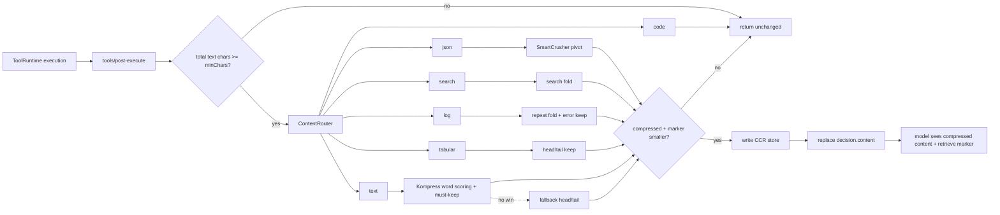

# dsh-headroom

> Headroom-inspired automatic context compression for **DeepSeek Harness (dsh)**.

Tool outputs are compressed before they reach the model. JSON, search results, logs,
tabular data, and long prose each go through a dedicated deterministic compressor.
Every **lossy** compression stores the exact original in a local CCR store and injects a
short marker, so the model can call `headroom_retrieve(id=…)` to recover the original
byte-for-byte.

```text
 tool body settles
        │
        ▼
 tools/post-execute   ← dsh-headroom compresses here
        │
        ▼
 tool/result enters session log / model history (compressed content + CCR marker)
        │
        ▼
 model calls headroom_retrieve(id=…) when it needs the exact original
```

## Features

- **Automatic tool-output compression** via the `tools/post-execute` seam.
- **Content router with specialized compressors**:

  | Content type | Strategy |
  |--------------|----------|
  | JSON array / object | SmartCrusher-style pivot: `_keys` + `_rows` + `_common`, long-cell truncation |
  | grep / ripgrep output | Fold by file: `file (N matches)` + `line[:col]: rest` |
  | build / test / log output | Consecutive-repeat folding + `error/fail/exception/assert` context preserved |
  | CSV / TSV / markdown tables | Keep header + first/last rows, offload the middle |
  | Long prose | **Kompress-style ML compression** (default): word-level scoring + must-keep protection + reversible CCR; `textStrategy: 'head-tail'` switches back to truncation |
  | Code | **Not compressed** (no AST compressor in this JS port; line-numbered `read`/`str_replace_editor` output is detected as code first) |
  | File tools | **Not compressed** by default (`read`/`str_replace_editor`/`edit`/`write` and paths matching `*.js/*.ts/*.json/*.yml`) |

> **Kompress text compression** (following [Headroom](https://github.com/headroomlabs-ai/headroom)'s
> [Kompress-v2-base](https://huggingface.co/chopratejas/kompress-v2-base) ML model):
> the text is split into words, each word is scored
> (`score = keepProb × (0.5 + 0.5 × spanScore)`, mirroring the model's token-classifier +
> span-CNN dual heads), words with `score > 0.5` are kept (or the top-k by `targetRatio`),
> and semantically fragile words — numbers, hex, ALLCAPS identifiers, paths, file extensions,
> CLI flags, CamelCase — are **always kept**. The default scorer is a deterministic pure-JS
> heuristic; the real Kompress-v2-base model can be plugged in at the library
> level via `compressKompressText(text, { scorer })` /
> `createKompressCompressor({ scorer })` while the pipeline stays identical
> (the plugin config does not expose `scorer` yet).

- **Reversible compression (CCR)**: `headroom_retrieve` / `headroom_compress` /
  `headroom_stats` mirror Headroom's MCP surface.
- **Persistence**: CCR store defaults to `<DSH_HOME>/storages/dsh-headroom-ccr.json`
  (1 s debounce, atomic replace, configurable TTL and entry cap).
- **Safe defaults**: short text, code, error outputs, excluded tools, and the plugin's
  own tools are never compressed.
- **Cross-platform**: pure JavaScript + Node built-ins, no native build step.
  The CI matrix lives in [`.github/workflows/ci.yml`](./.github/workflows/ci.yml).

## How it works



- `lib/compress.js` — pure-function compressors, no `node:*` imports.
- `lib/kompress.js` — the Kompress-style prose pipeline (word scoring + must-keep
  protection), ported from Headroom's Kompress-v2-base ML approach; pluggable scorer.
- `lib/ccr.js` — in-memory CCR store with debounced persistence.
- `lib/index.js` — dsh plugin entrypoint.

## Compression results

### Stress configuration

`node scripts/verify-compress.mjs` with `minChars=120, maxRows=40, maxCellChars=80, maxTextChars=400`:

| Sample | Type | Before (chars) | After (chars) | Saved |
|--------|------|--------:|--------:|-----:|
| JSON array, 200 rows | json | 62 491 | 9 302 | **85.1%** |
| grep results, 270 hits | search | 10 772 | 4 603 | **57.3%** |
| log, 180 lines | log | 3 909 | 1 125 | **71.2%** |
| CSV, 201 lines | tabular | 19 814 | 3 029 | **84.7%** |
| prose, 400 segments | text | 29 506 | 546 | **98.1%** |
| Kompress prose (facts + boilerplate) | text | 16 439 | 2 029 | **87.7%** |
| code | code | 493 | 493 | 0% (protected) |
| short text | text | 19 | 19 | 0% (below threshold) |

> Token estimates in the script use `chars / 4`; real token counts depend on the model
> tokenizer. Every lossy compression stores the original, so nothing is unrecoverable.
> The Kompress sample keeps every fragile fact (`HTTP`/`500`/hex/path/`IndexError`)
> while deleting the repeated `boilerplatephrase` (recoverable via CCR).

### Default configuration

With defaults (`minChars=600, maxRows=80, maxCellChars=200, maxTextChars=2400`):

| Sample | Type | Saved |
|--------|------|-----:|
| JSON array, 200 rows | json | 65.6% |
| grep results, 90 hits | search | 41.3% |
| log, 180 lines | log | 56.8% |
| CSV, 201 lines | tabular | 59.8% |
| prose, 400 segments | text | 94.7% |

### Effectiveness safety

`scripts/verify-compress.mjs` also asserts:

1. Structured facts (JSON keys/counts, file groups, `ERROR/WARN` lines) remain visible
   after compression.
2. Code, short text, and error outputs stay byte-identical.
3. For every lossy compression, `headroom_retrieve` returns the exact original.
4. A `NEEDLE-42` fact hidden in the omitted middle of prose is absent from the
   compressed view but fully recoverable via CCR.
5. After Kompress compression, fragile facts (`HTTP`, `500`, `0x1f4d2a8b`,
   `/var/log/app.log`, `IndexError`) stay visible while the repeated
   `boilerplatephrase` is deleted and recoverable via CCR.

`scripts/verify-apply.mjs` (requires `@deepseek-ai/dsh-tools` resolvable) verifies the
real `apply()` surface: the post-execute listener is installed, a large grep output is
compressed and retrievable, and excluded/own/code/error/short outputs are untouched.

## Installation

### Requirements

| Item | Requirement |
|------|-------------|
| Node.js | `>= 22.0.0` |
| DeepSeek Harness | `>= 0.0.1-rc.5 < 0.1.0` |
| Package manager | `pnpm >= 11` recommended |
| OS | Windows / macOS / Linux |

### Recommended

Install directly from GitHub (same command on Windows / macOS / Linux):

```bash
dsh plugin --profile web add github:giter00/dsh-headroom
```

If `dsh` is not on PATH, invoke the profile CLI directly with the same argument:

```bash
# Windows PowerShell
node "$env:USERPROFILE\.dsh\profiles\node_modules\@deepseek-ai\dsh\lib\bin.js" plugin --profile web add github:giter00/dsh-headroom

# macOS / Linux
node "$HOME/.dsh/profiles/node_modules/@deepseek-ai/dsh/lib/bin.js" plugin --profile web add github:giter00/dsh-headroom
```

> pnpm pulls the repository's default branch (`main`) and reconciles the
> `dsh-headroom` bundle into the profile automatically.

### Manual

Edit `<DSH_HOME>/profiles/web/package.json`:

```jsonc
{
  "dependencies": {
    "dsh-headroom": "github:giter00/dsh-headroom"
  },
  "dsh": {
    "profile": {
      "bundles": [
        "dsh-headroom"
      ]
    }
  }
}
```

Then:

```bash
cd "$DSH_HOME/profiles/web"
pnpm install
```

Restart dsh.

### Uninstall

```bash
dsh plugin --profile web remove dsh-headroom
```

## Configuration

Override via `cordis.patch.yml`:

```yaml
- id: dsh-headroom
  config:
    enabled: true
    minChars: 600
    maxRows: 80
    maxCellChars: 200
    maxSearchMatchesPerFile: 60
    maxLogLines: 80
    maxTextChars: 2400
    maxTabularLines: 80
    excludeTools: []
    noFoldForTools: ['read', 'str_replace_editor', 'edit', 'write']
    noFoldForPatterns: ['*.js', '*.ts', '*.json', '*.yml', '*.yaml']
    markerStyle: full          # full | compact
    includeErrors: false
    textStrategy: auto        # auto | kompress | head-tail
    kompress:
      enabled: true
      minWords: 10
      chunkWords: 350
      scoreThreshold: 0.5
      targetRatio: null       # null=threshold decision; 0.3=force keep top 30%
      mustKeep: true
      maxWordChars: 64
    ccr:
      enabled: true
      persist: true
      ttlMs: 86400000
      maxEntries: 2000
```

| Field | Default | Description |
|-------|---------|-------------|
| `enabled` | `true` | Master switch |
| `minChars` | `600` | Minimum text-block length before compression is considered |
| `maxRows` | `80` | Maximum JSON pivot rows kept |
| `maxCellChars` | `200` | Cell truncation length for JSON (search match lines are kept in full) |
| `maxSearchMatchesPerFile` | `60` | Search hits kept per file |
| `maxLogLines` | `80` | Log head/tail budget |
| `maxTextChars` | `2400` | Prose head/tail budget (head-tail strategy) |
| `maxTabularLines` | `80` | Tabular head/tail budget |
| `excludeTools` | `[]` | `*` wildcard patterns; matched tools are never compressed |
| `noFoldForTools` | `['read','str_replace_editor','edit','write']` | File-content tools are never compressed, keeping read→edit snapshots consistent |
| `noFoldForPatterns` | `['*.js','*.ts','*.json','*.yml','*.yaml']` | Matched file paths/tool names are never compressed; protects source/config files |
| `markerStyle` | `'full'` | `full` keeps strategy/savings plus the `headroom_retrieve` hint; `compact` emits only `id="hr:…"` to reduce marker noise |
| `includeErrors` | `false` | Compress error tool outputs too |
| `textStrategy` | `'auto'` | Prose strategy: `auto`=Kompress first, head/tail fallback; `kompress`=Kompress only; `head-tail`=truncation only |
| `kompress.enabled` | `true` | `false` routes prose to head/tail |
| `kompress.minWords` | `10` | Skip texts with fewer words (matches Headroom) |
| `kompress.chunkWords` | `350` | Words per inference chunk (coupled to the model, like Headroom) |
| `kompress.scoreThreshold` | `0.5` | Keep when `score > threshold` (matches Headroom's default) |
| `kompress.targetRatio` | `null` | Force keep-ratio via top-k scoring; `null` = threshold decision |
| `kompress.mustKeep` | `true` | Always keep fragile words (numbers/hex/ALLCAPS/paths/extensions/flags/CamelCase) |
| `kompress.maxWordChars` | `64` | Longer words (e.g. unbroken CJK runs) are subdivided for scoring |
| `ccr.enabled` | `true` | Disable to turn off lossy compression entirely |
| `ccr.persist` | `true` | Persist the CCR store to disk |
| `ccr.ttlMs` | `86400000` | Original-content retention |
| `ccr.maxEntries` | `2000` | Maximum store entries |

## Model-visible tools

| Tool | Arguments | Purpose |
|------|-----------|---------|
| `headroom_retrieve` | `id` | Recover the exact original of a compressed tool result |
| `headroom_compress` | `text` | Compress arbitrary text |
| `headroom_stats` | none | Show process compression statistics |

Marker format:

```text
[headroom: search-fold 12345→987 chars; headroom_retrieve(id="hr:0123456789abcdef")]
```

## Development

```bash
node --check lib/index.js && node --check lib/compress.js && node --check lib/ccr.js
node tests/compress.test.js
node scripts/verify-compress.mjs
node scripts/verify-apply.mjs   # requires @deepseek-ai/dsh-tools
```

## Known limitations

- **The default scorer is a heuristic simulation, not real model inference**:
  `lib/kompress.js` faithfully ports Headroom's Kompress-v2-base pipeline structure
  and scoring formula, but the default scores come from a deterministic pure-JS
  heuristic. To get real model semantics, plug an ONNX/PyTorch scorer at the
  library level.
- **Kompress output is a fragment of kept words**: the default threshold deletes
  many ordinary words aggressively, so readability is limited — it is designed
  for model consumption plus CCR retrieval of the exact original when needed.
- **Conservative no-compression cases**: texts made entirely of must-keep tokens,
  or purely repeated CJK text, fall back to head/tail or pass through unchanged
  so content is never wiped to zero.
- **Template text is not de-duplicated**: repeated numbers/identifiers are each
  preserved by must-keep semantics, so templated output may keep many repeated
  fact tokens and compress less than ordinary prose.

## Differences from Headroom

| Dimension | Headroom | dsh-headroom |
|-----------|----------|--------------|
| Integration | proxy / wrap / MCP / SDK | native dsh plugin on `tools/post-execute` |
| JSON | SmartCrusher (Rust core) | JS pivot (`_keys` / `_rows` / `_common`) |
| Code | AST CodeCompressor | skipped by default |
| Text | Kompress-v2-base ML model (ONNX/PyTorch) | **same Kompress pipeline** (word scoring + must-keep + threshold/top-k); pure-JS heuristic scorer by default, the real model can be plugged in via `createKompressCompressor({ scorer })` (not exposed in plugin config yet) |
| Reversibility | CCR | local CCR store + `headroom_retrieve` |
| Native deps | some extras (onnxruntime/torch) | none with the default heuristic; only when plugging in the real model |

## License

[MIT](./LICENSE)

## Acknowledgements

Design and compression strategies are inspired by
[Headroom](https://github.com/headroomlabs-ai/headroom) (Apache-2.0).
