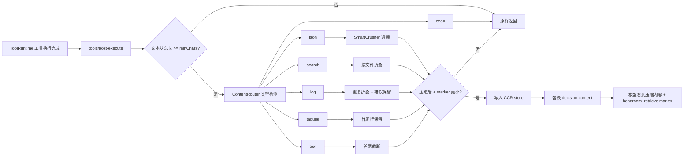

# dsh-headroom

> 适配 **DeepSeek Harness (dsh)** 的上下文自动压缩插件，思路参考
> [Headroom](https://github.com/headroomlabs-ai/headroom)。

工具输出在进入模型之前先被压缩：JSON、搜索、日志、表格与长文本各自走专用压缩器；
所有**有损压缩**都会把原文存入本地 CCR store，并在压缩结果里注入一个短 marker，
模型需要精确原文时调用 `headroom_retrieve(id=…)` 即可逐字节取回。

```text
 tool body settles
        │
        ▼
 tools/post-execute   ← dsh-headroom 在此压缩
        │
        ▼
 tool/result 进入 session log / 模型历史（压缩后内容 + CCR marker）
        │
        ▼
 模型需要原文时调用 headroom_retrieve(id=…)
```

## 特性

- **自动压缩工具输出**：挂载 `tools/post-execute`，在工具结果物化之前替换文本内容。
- **内容路由，专用压缩器**：

  | 内容类型 | 压缩策略 |
  |----------|----------|
  | JSON 数组/对象 | SmartCrusher 风格透视：`_keys` + `_rows` + `_common`，长单元格截断 |
  | grep/ripgrep 结果 | 按文件折叠：`file (N matches)` + `line[:col]: rest` |
  | 构建/测试/日志 | 连续重复行折叠 + 保留 `error/fail/exception/assert` 上下文 |
  | CSV/TSV/markdown 表格 | 保留表头与首尾行，中间行 offload |
  | 长文本 | 首尾截断 + CCR marker（原文可精确取回） |
  | 代码 | **默认不压缩**（JS 端口不做 AST 压缩，避免破坏可补丁字节） |

- **可逆压缩（CCR）**：所有有损压缩都保存原文，`headroom_retrieve` 按 id 精确取回；
  `headroom_stats` 查看节省量；`headroom_compress` 压缩任意文本。
- **持久化**：CCR store 默认写入 `<DSH_HOME>/storages/dsh-headroom-ccr.json`
  （1 秒去抖、原子替换、TTL + 最大条目数可配）。
- **无害跳过**：短文本、代码、错误输出、`excludeTools` 命中的工具、本插件自身工具
  都不会被压缩。
- **跨平台**：纯 JavaScript + Node 内置模块，无原生编译依赖；路径全部通过
  `node:path` 处理，`DSH_HOME` 支持环境变量覆盖，Windows / macOS / Linux 行为一致。
  CI 矩阵见 [`.github/workflows/ci.yml`](./.github/workflows/ci.yml)。

## 实现方式



- `lib/compress.js`：纯函数压缩器，无 `node:*` 依赖，可独立测试。
- `lib/ccr.js`：CCR store，内存 Map + 去抖持久化到 `<DSH_HOME>/storages/`。
- `lib/index.js`：dsh 插件入口，注册 `tools/post-execute` 监听器与三个工具。
- `dsh.plugin.json` + `cordis.patch.yml`：dsh 插件/bundle 清单与补丁。

## 压缩效果

### 压力测试配置（更激进，用于验证压缩器上限）

`node scripts/verify-compress.mjs` 在 `minChars=120, maxRows=40, maxCellChars=80, maxTextChars=400` 下的结果：

| 样本 | 类型 | 压缩前（字符） | 压缩后（字符） | 节省 |
|------|------|--------:|--------:|-----:|
| JSON 数组 200 行 | json | 62 491 | 9 302 | **85.1%** |
| grep 结果 270 条 | search | 10 772 | 4 603 | **57.3%** |
| 日志 180 行 | log | 3 909 | 1 125 | **71.2%** |
| CSV 201 行 | tabular | 19 814 | 3 029 | **84.7%** |
| 长文本 400 段 | text | 29 506 | 546 | **98.1%** |
| 代码 | code | 493 | 493 | 0%（故意不压） |
| 短文本 | text | 19 | 19 | 0%（未达阈值） |

> token 估算：脚本按 `chars / 4` 粗估，实际 token 与模型 tokenizer 相关。
> 所有有损压缩均保存原文，`headroom_retrieve` 可精确取回。

### 默认配置

默认配置更保守（`minChars=600, maxRows=80, maxCellChars=200, maxTextChars=2400`）：

| 样本 | 类型 | 节省 |
|------|------|-----:|
| JSON 数组 200 行 | json | 65.6% |
| grep 结果 90 条 | search | 41.3% |
| 日志 180 行 | log | 56.8% |
| CSV 201 行 | tabular | 59.8% |
| 长文本 400 段 | text | 94.7% |

### 不损害效果的验证

`node scripts/verify-compress.mjs` 同时断言：

1. 结构化输出中的关键事实（JSON 键/计数、文件分组、`ERROR/WARN` 行）在压缩后仍可见；
2. 代码、短文本、错误输出保持字节不变；
3. 每个有损压缩的原文都能通过 `headroom_retrieve` **逐字节取回**；
4. 长文本中间被省略的 `NEEDLE-42` 事实，压缩视图不可见，但 CCR 能精确恢复。

`node scripts/verify-apply.mjs`（需要能解析 `@deepseek-ai/dsh-tools`）进一步验证：

- `apply()` 注册了 `tools/post-execute` 监听器和 3 个工具；
- 大 grep 输出在进入模型前被压缩并带 marker；
- `headroom_retrieve` 取回原文与压缩前完全一致；
- `fs-*` 排除工具、自身工具、代码、错误、短输出全部原样。

## 安装

### 环境要求

| 项目 | 要求 |
|------|------|
| Node.js | `>= 22.0.0`（推荐 Node 22 LTS 或更高） |
| DeepSeek Harness | `>= 0.0.1-rc.5 < 0.1.0` |
| 包管理器 | 推荐 `pnpm >= 11`；`npm` / `yarn` 也可用于本地开发 |
| 操作系统 | Windows / macOS / Linux（纯 JS，无原生编译） |

### 一键安装（推荐）

直接从 GitHub 仓库安装（Windows / macOS / Linux 通用）：

```bash
dsh plugin --profile web add github:giter00/dsh-headroom
```

如果 `dsh` 不在 PATH 上，可先定位 profile 内的 CLI 再执行同一命令：

```bash
# Windows PowerShell
node "$env:USERPROFILE\.dsh\profiles\node_modules\@deepseek-ai\dsh\lib\bin.js" plugin --profile web add github:giter00/dsh-headroom

# macOS / Linux
node "$HOME/.dsh/profiles/node_modules/@deepseek-ai/dsh/lib/bin.js" plugin --profile web add github:giter00/dsh-headroom
```

> pnpm 会在安装时拉取 GitHub 仓库的默认分支（`main`），并自动把
> `dsh-headroom` 追加到 profile 的 bundle 列表。

### 手动安装

也可以直接编辑 `<DSH_HOME>/profiles/web/package.json`：

```jsonc
{
  "dependencies": {
    "dsh-headroom": "github:giter00/dsh-headroom"
  },
  "dsh": {
    "profile": {
      "bundles": [
        // ...其他 bundles
        "dsh-headroom"
      ]
    }
  }
}
```

然后进入 profile 目录安装依赖：

```bash
cd "$DSH_HOME/profiles/web"      # Windows PowerShell: cd $env:DSH_HOME\profiles\web
pnpm install
```

重启 dsh 后生效。

### 卸载

```bash
dsh plugin --profile web remove dsh-headroom
```

## 配置

在 profile 的 `cordis.patch.yml`（或 `--patch` 覆盖层）中可覆盖默认配置：

```yaml
- id: dsh-headroom
  config:
    enabled: true
    minChars: 600
    maxRows: 80
    maxCellChars: 200
    maxSearchMatchesPerFile: 60
    maxLogLines: 80
    maxTextChars: 2400
    maxTabularLines: 80
    excludeTools: []
    includeErrors: false
    ccr:
      enabled: true
      persist: true
      ttlMs: 86400000
      maxEntries: 2000
```

| 字段 | 默认值 | 说明 |
|------|--------|------|
| `enabled` | `true` | 总开关 |
| `minChars` | `600` | 文本块至少多少字符才考虑压缩 |
| `maxRows` | `80` | JSON 透视保留的最大行数 |
| `maxCellChars` | `200` | JSON/search 单元格字符串截断长度 |
| `maxSearchMatchesPerFile` | `60` | 每个文件保留的搜索命中数 |
| `maxLogLines` | `80` | 日志保留的首尾行数 |
| `maxTextChars` | `2400` | 长文本首尾保留字符数 |
| `maxTabularLines` | `80` | 表格保留的首尾行数 |
| `excludeTools` | `[]` | `*` 通配符；命中的工具不压缩 |
| `includeErrors` | `false` | 是否压缩工具错误输出 |
| `ccr.enabled` | `true` | 关闭后不进行有损压缩 |
| `ccr.persist` | `true` | 是否持久化 CCR store |
| `ccr.ttlMs` | `86400000` | 原始内容保留时长（毫秒） |
| `ccr.maxEntries` | `2000` | 内存/持久化 store 最大条目数 |

## 模型可见工具

| 工具 | 参数 | 作用 |
|------|------|------|
| `headroom_retrieve` | `id` | 取回被压缩工具结果的完整原文 |
| `headroom_compress` | `text` | 压缩任意文本，返回策略与压缩结果 |
| `headroom_stats` | 无 | 查看本进程压缩统计 |

压缩后的 tool result 会携带如下 marker：

```text
[headroom: search-fold 12345→987 chars; retrieve full original with headroom_retrieve(id="hr:0123456789abcdef")]
```

## 项目结构

```text
dsh-headroom/
├── lib/
│   ├── index.js          # dsh 插件入口：post-execute 钩子 + 3 个工具
│   ├── compress.js       # 内容路由与确定性压缩器（纯 JS，无 node:* 依赖）
│   └── ccr.js            # CCR store：内存 + 去抖持久化
├── scripts/
│   ├── verify-compress.mjs   # 压缩效果 / 信息保留 / CCR 可逆验证
│   └── verify-apply.mjs      # apply() 集成冒烟（需要 dsh-tools 可解析）
├── tests/
│   └── compress.test.js      # 单元测试
├── dsh.plugin.json           # dsh 插件清单
├── cordis.patch.yml          # bundle patch
├── package.json
├── README.md
├── README.en.md
└── LICENSE
```

## 开发与验证

```bash
# 语法检查
node --check lib/index.js && node --check lib/compress.js && node --check lib/ccr.js

# 单元测试（无需 harness 依赖）
node tests/compress.test.js

# 压缩效果 + 信息保留 + CCR 可逆验证（无需 harness 依赖）
node scripts/verify-compress.mjs

# apply() 集成冒烟（需要 @deepseek-ai/dsh-tools 可解析，
# 例如链接 dsh checkout 的 node_modules）
node scripts/verify-apply.mjs
```

## 与 Headroom 的差异

| 维度 | Headroom | dsh-headroom |
|------|----------|--------------|
| 集成方式 | proxy / wrap / MCP / SDK | dsh 原生插件，直接挂 `tools/post-execute` |
| JSON | SmartCrusher（Rust core） | JS 透视压缩（`_keys`/`_rows`/`_common`） |
| 代码 | AST CodeCompressor | 默认跳过（保证可补丁字节安全） |
| 文本 | Kompress-v2-base ML 模型 | 首尾截断 + CCR 可逆取回 |
| 可逆性 | CCR | 本地 CCR store + `headroom_retrieve` |
| 原生依赖 | 部分 extra 需要 | 无 |

## License

[MIT](./LICENSE)

## 致谢

本项目的设计思路与压缩策略参考
[Headroom](https://github.com/headroomlabs-ai/headroom)（Apache-2.0）。
